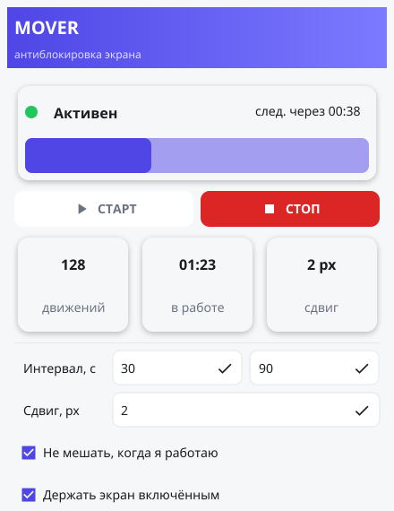

# Mover

Приложение для Windows, которое не даёт экрану заблокироваться: через случайные
промежутки времени оно на пару пикселей сдвигает курсор и тут же возвращает его
на место. Для системы это обычное движение мыши, и таймер простоя начинает
отсчёт заново.



Оформление следует системной теме Windows — на тёмной теме окно
[выглядит так](docs/screenshot-dark.png).

## Зачем это нужно

Корпоративная политика или личные настройки часто гасят экран и требуют пароль
уже через несколько минут простоя. Это мешает, когда компьютер работает, но мышь
никто не трогает: идёт долгая сборка, крутится видеозвонок, читается документ
с планшета, выполняется перенос данных. Mover держит сеанс живым, пока вы этого
хотите, и полностью останавливается одним нажатием.

## Возможности

- **Случайный интервал.** Пауза между движениями выбирается случайно в заданных
  границах — например, от 30 до 90 секунд. Ровный «тик в тик» выглядел бы
  машинно, случайность ближе к живой работе.
- **Не мешает, когда вы за компьютером.** Если система видит вашу собственную
  активность, очередное движение пропускается — курсор не дёрнется под рукой
  в момент работы.
- **Держит экран включённым.** Дополнительно запрещает гасить экран и уходить
  в сон, пока таймер работает.
- **Настройки прямо в окне.** Границы интервала и величину сдвига можно менять
  на ходу, перезапуск не нужен — значения сразу сохраняются.
- **Живёт в трее.** Окно прячется в область уведомлений по крестику и по кнопке
  «свернуть», управление доступно из контекстного меню иконки.
- **Автозапуск с Windows.** Одна галочка — приложение стартует вместе с системой
  и сразу начинает работу, не показывая окно.
- **Один экземпляр.** Повторный запуск не плодит процессы, а показывает окно уже
  работающего приложения.
- **Не требует установки и прав администратора.** Один exe-файл, который можно
  носить с собой на флешке.

## Установка

Скачайте или соберите `mover.exe` и положите в любой каталог, где у вас есть
права на запись, — рядом с ним появятся файл настроек и журнал работы. Установка
и права администратора не нужны.

## Как пользоваться

### Окно

| Элемент | Что показывает |
| --- | --- |
| Индикатор и надпись | Зелёная пульсирующая точка — таймер работает, серая — остановлен |
| «след. через» и полоса | Сколько осталось до следующего движения |
| **СТАРТ** / **СТОП** | Включить и выключить таймер; активна всегда одна из кнопок |
| Плитка «движений» | Сколько движений сделано с момента запуска |
| Плитка «в работе» | Сколько времени таймер работает |
| Плитка «сдвиг» | Текущая величина сдвига курсора |

### Иконка в трее

Цвет иконки отражает состояние: цветная — таймер работает, серая — остановлен.
Левый клик показывает окно, правый открывает меню:

| Пункт | Что делает |
| --- | --- |
| **Запустить** | Включает таймер |
| **Остановить** | Выключает таймер |
| **Автозапуск с Windows** | Галочка: добавляет приложение в автозагрузку **и** включает автостарт таймера |
| **Показать окно** | Достаёт окно из трея |
| **Закрыть** | Полностью завершает приложение |

### Поведение окна

- **Крестик и «свернуть» прячут окно в трей**, а не закрывают программу: так её
  не потерять случайным кликом. Полностью выйти можно только пунктом «Закрыть».
- **При запуске вместе с Windows окно не показывается** — приложение сразу уходит
  в трей с уже работающим таймером и не мешает загрузке рабочего стола.
- **На время блокировки экрана окно прячется само** и возвращается после
  разблокировки. Так приложение не рисует в погашенный экран часами — иначе
  графический контекст успевает «протухнуть», и окно перестаёт отзываться.

## Настройки

Интервал, сдвиг и оба переключателя меняются прямо в окне. Значения хранятся
в файле `config.yml` рядом с exe; если туда нельзя писать (например, программа
лежит в `Program Files`), файл переезжает в `%APPDATA%\mover\`.

| Параметр | По умолчанию | Границы | Смысл |
| --- | --- | --- | --- |
| `IntervalMinSec` | 30 | 5…3600 | Нижняя граница случайного интервала, секунды |
| `IntervalMaxSec` | 90 | 5…3600 | Верхняя граница; поднимается до нижней, если задана меньше неё |
| `MovePixels` | 2 | 1…50 | На сколько пикселей сдвигать курсор |
| `IdleThresholdSec` | 30 | 5…3600 | Сколько система должна простаивать, чтобы движение считалось уместным |
| `SkipWhenUserActive` | `true` | — | Пропускать движение, если за компьютером работают |
| `KeepScreenAwake` | `true` | — | Запрещать гашение экрана и сон, пока таймер работает |

Значения вне границ молча приводятся к ближайшему допустимому — испорченный файл
не помешает приложению запуститься. Состояние автозапуска в `config.yml`
не хранится: оно живёт в реестре, поэтому галочка в трее всегда показывает
реальное положение дел, даже если автозагрузку отключили через диспетчер задач.

Файл перезаписывается при изменении настроек в окне, так что добавленные вручную
комментарии в нём не сохранятся.

Журнал по умолчанию молчит: в него попадают только предупреждения и ошибки,
а сам файл `app.log` появляется рядом с exe (или в `%LOCALAPPDATA%\mover\`),
лишь когда есть что записать. Если он не создан — значит, приложению не на что
пожаловаться. Разросшийся журнал обрезается по достижении 1 МБ.

Подробный вывод включается флагом `-debug`: запуск `mover.exe -debug` пишет
в файл всё, включая обычные события, и дублирует их в консоль, если она есть.

## Как это работает

Движение выполняется системным вызовом `SendInput` — тем же механизмом, которым
Windows сообщает о настоящей мыши. Похожий по смыслу `SetCursorPos` не подошёл бы:
он перемещает указатель, но не порождает события ввода, поэтому таймер простоя
не сбрасывается и экран всё равно блокируется. Сдвиг задаётся в абсолютных
координатах — относительный проходит через ускорение мыши, и один-два пикселя
могли бы округлиться в ноль.

Через 50 миллисекунд курсор возвращается на прежнее место, но только если он всё
ещё там, куда его поставили: если за эти доли секунды вы взялись за мышь,
приложение не мешает.

Чтобы отличать вашу активность от собственной, приложение запоминает время своего
последнего движения. Без этого ничего бы не вышло: инжект обновляет системный
счётчик простоя ровно так же, как живой пользователь, и компьютер всегда выглядел
бы занятым.

## Если что-то пошло не так

| Симптом | Что делать |
| --- | --- |
| Приложение не запускается, окна нет | Открыть `app.log` рядом с exe (или в `%LOCALAPPDATA%\mover\`) — туда пишутся ошибки. Если файла нет, запустить `mover.exe -debug` и посмотреть подробный журнал |
| Экран всё равно блокируется | Убедиться, что таймер запущен, а интервал меньше таймаута блокировки. Блокировку по политике безопасности и Dynamic Lock обойти нельзя |
| В журнале «движение курсора не выполнено ... Access is denied» | Экран заблокирован либо в фокусе окно с повышенными правами — движение в такой момент пропускается, это нормально |
| Настройки не сохраняются | Нет прав на запись в каталог с exe; проверьте `%APPDATA%\mover\config.yml` |

## Ограничения

- Приложение **предотвращает** блокировку, но не снимает уже заблокированный
  экран.
- Dynamic Lock и принудительная блокировка через групповые политики так
  не обходятся.
- Движение отклоняется, когда в фокусе процесс с более высоким уровнем
  целостности или показан защищённый рабочий стол UAC. Такой такт пропускается
  с записью в журнал, приложение продолжает работать.
- Корпоративные средства защиты нередко относят подобные утилиты
  к нежелательному ПО. Перед использованием на рабочей машине стоит убедиться,
  что это не нарушает правила.

## Сборка из исходников

Нужны Go 1.26+, gcc из MSYS2 mingw64 (fyne использует OpenGL через cgo),
[goversioninfo](https://github.com/josephspurrier/goversioninfo) и GNU Make.

```sh
make build-win   # mover.exe с иконкой, версией и манифестом
make help        # остальные цели
```

Первая сборка занимает около четырёх минут — компилируются привязки к OpenGL
и GLFW; дальше секунды за счёт кэша. Готовый exe весит порядка 25 МБ: внутрь
упакован весь графический рантайм.

Подробности разработки — устройство пакетов, отладка в VS Code, подводные камни
cgo и ресурсов Windows — в [CLAUDE.md](CLAUDE.md).
